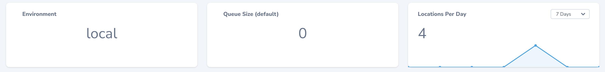

# Nova Single Value Card

A Laravel Nova card that displays a single value.



I really like to use Trend Metric Card from Laravel Nova to get a quick overview. But sometimes I want to have values in
the cards that can't be represented by the standard trends. Of course there are already some card packages that show 
e.g. the total records in a card. The reason why I made this small package anyway is because I want to show all values 
and don't want to have a separate package for each case. If I want to display the total records I can simply pass 
`Model::count()` and that's it. And then everything is kept in the same style and does not mix.

And yes, I'm considering doing the same thing for the trends and just passing the class in the constructor.

## Requirements
- PHP 7.4 or higher
- Nova 4

## Installation

```bash
composer require hapheus/nova-single-value-card
```

## Usage

```php
namespace App\Nova\Dashboards;

use App\Nova\Metrics\LocationsPerDay;
use Hapheus\NovaSingleValueCard\NovaSingleValueCard;
use Illuminate\Support\Facades\App;
use Laravel\Nova\Dashboards\Main as Dashboard;

class Main extends Dashboard
{
    public function cards()
    {
        return [
            new NovaSingleValueCard('Environment', config('app.env')),
            new NovaSingleValueCard('Queue Size (default)', App::make('queue.connection')->size('default')),
            new LocationsPerDay,
        ];
    }
}

```

## WIP
* Implementation of simple colors for the text and the background
